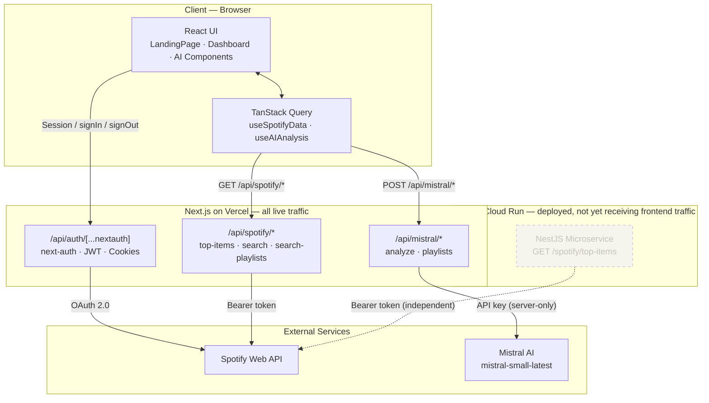
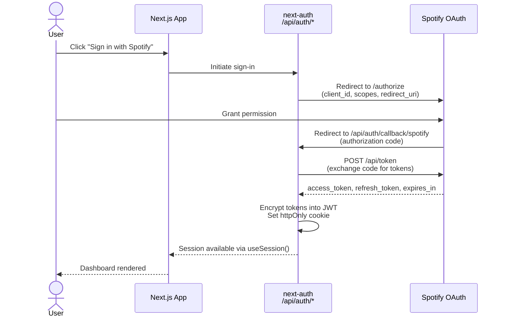
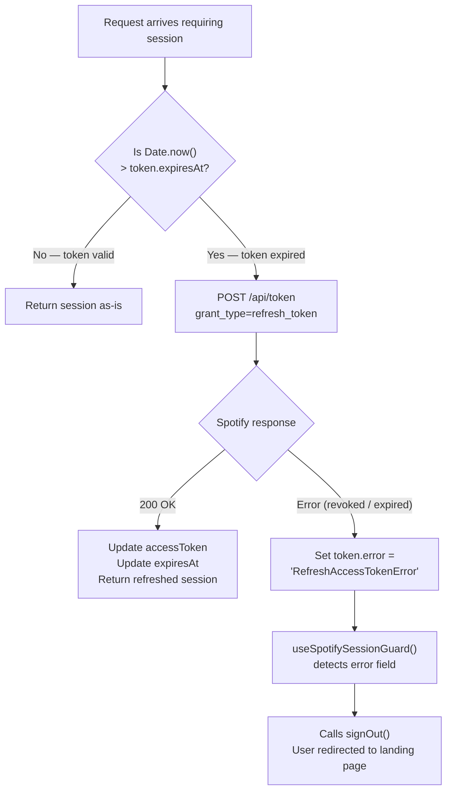
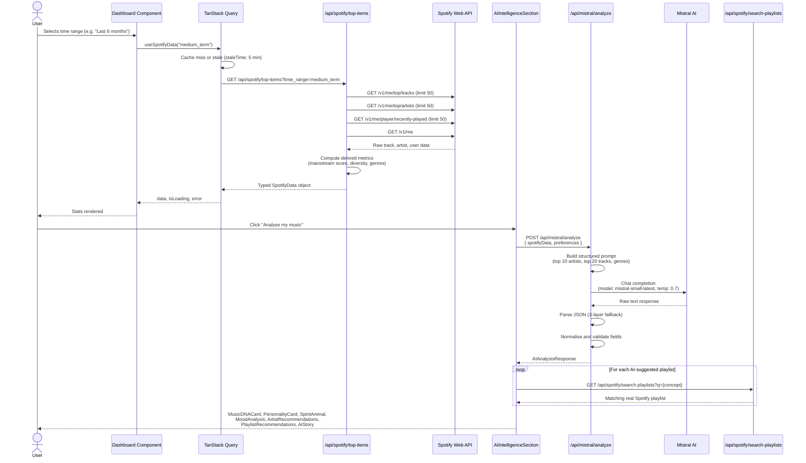
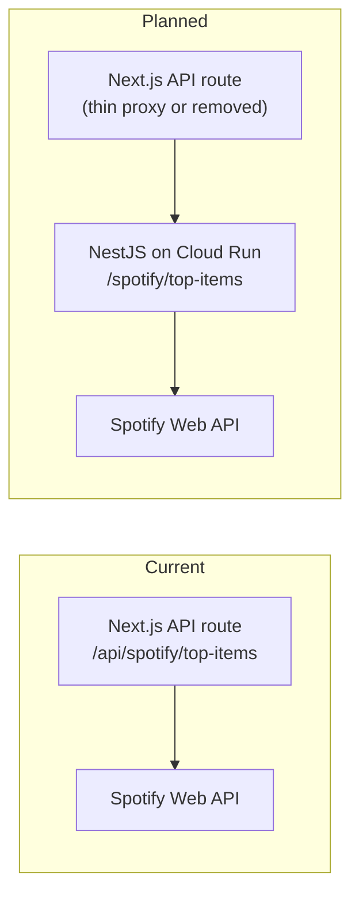

# Architecture

This document describes the technical architecture of My Spotify Wrapped: how the system is structured, how data flows through it, and the rationale behind key design decisions.

---

## Table of Contents

1. [System Overview](#1-system-overview)
2. [App Router Structure](#2-app-router-structure)
3. [Authentication: Spotify OAuth and JWT](#3-authentication-spotify-oauth-and-jwt)
4. [End-to-End Data Flow](#4-end-to-end-data-flow)
5. [State Management: TanStack Query](#5-state-management-tanstack-query)
6. [Prompt Engineering and LLM Reliability](#6-prompt-engineering-and-llm-reliability)
7. [Caching Strategy](#7-caching-strategy)
8. [TypeScript Contracts](#8-typescript-contracts)
9. [Optional NestJS Microservice](#9-optional-nestjs-microservice)

---

## 1. System Overview

The application is a **Next.js monolith** using the App Router. The React frontend and all server-side API logic — Spotify data fetching, Mistral AI calls, authentication — live in the same repository and deploy together to Vercel. A NestJS microservice is separately deployed to Google Cloud Run, but the frontend currently routes all traffic through the Next.js API layer and does not call Cloud Run directly.



**Core principle**: all secrets (Spotify client secret, Mistral API key, NextAuth secret) are environment variables accessible only in server-side API route handlers. The browser never receives or transmits them directly.

> **Current state vs. planned state**: The Next.js API routes handle all data fetching today. The intended next step is to route the Spotify and Mistral calls through the NestJS service on Cloud Run, while keeping authentication in Next.js (next-auth is framework-specific and cannot be moved to NestJS without a full rewrite using Passport.js).

---

## 2. App Router Structure

The Next.js App Router enforces separation of concerns through the file system. Anything inside `app/api/` runs exclusively on the server; React components in `app/` and `components/` run in the browser.

```
src/app/
├── layout.tsx                   # Root shell — mounts ReactQueryProvider and Vercel Analytics
├── page.tsx                     # Route: /  — renders LandingPage inside SessionProvider
├── privacy/
│   └── page.tsx                 # Route: /privacy
└── api/                         # Server-only route handlers
    ├── auth/
    │   └── [...nextauth]/       # Handles all /api/auth/* paths (NextAuth)
    ├── spotify/
    │   ├── top-items/           # Primary data endpoint — tracks, artists, metrics
    │   ├── search/              # Artist and track search
    │   ├── search-playlists/    # Playlist search with optional track hydration
    │   └── search-track/       # Single track lookup
    └── mistral/
        ├── analyze/             # Full AI personality and music analysis
        └── playlists/           # AI-generated playlist suggestions
```

Each API route is a standard `route.ts` file exporting named HTTP method handlers (`GET`, `POST`). There are no shared Express middleware chains — each handler reads the session, validates input, calls the upstream API, and returns a typed response independently.

---

## 3. Authentication: Spotify OAuth and JWT

Authentication is managed entirely by **next-auth** (`src/lib/auth.ts`), using Spotify as the OAuth 2.0 provider.

### OAuth Flow



**Requested scopes**: `user-read-private`, `user-read-email`, `user-top-read`, `user-read-recently-played`, `user-follow-read`, `playlist-read-private`, `playlist-read-collaborative`, `user-library-read`.

### Automatic Token Refresh

Spotify access tokens expire after one hour. The next-auth `jwt` callback runs on every session read and handles rotation transparently:



```typescript
// src/lib/auth.ts (simplified)
async function refreshAccessToken(token: JWT): Promise<JWT> {
  const response = await fetch("https://accounts.spotify.com/api/token", {
    method: "POST",
    headers: { Authorization: `Basic ${btoa(`${clientId}:${clientSecret}`)}` },
    body: new URLSearchParams({
      grant_type: "refresh_token",
      refresh_token: token.refreshToken as string,
    }),
  });
  const refreshed = await response.json();
  return {
    ...token,
    accessToken: refreshed.access_token,
    expiresAt: Date.now() + refreshed.expires_in * 1000,
  };
}
```

The `useSpotifySessionGuard()` hook in `src/hooks/useSpotifyData.ts` monitors the client-side session for `error === "RefreshAccessTokenError"` and calls `signOut()` if found, ensuring no user is left in a silent broken-auth state.

---

## 4. End-to-End Data Flow

The following sequence covers a complete user session from page load through AI analysis.



---

## 5. State Management: TanStack Query

The application's client state is almost entirely **server state** — data that lives on Spotify's and Mistral's servers and must be fetched, cached, and kept fresh. TanStack Query is built specifically for this pattern.

### Global QueryClient Configuration

`src/providers/ReactQueryProvider.tsx` sets the following defaults for all queries:

```typescript
{
  staleTime: 5 * 60 * 1000,           // Data is fresh for 5 minutes; no refetch within that window
  gcTime: 30 * 60 * 1000,             // Inactive cache entries kept for 30 minutes
  refetchOnWindowFocus: false,         // Tab focus does not trigger a refetch
  refetchOnReconnect: "always",        // Network restoration always triggers a refetch
  retry: (failureCount, error) => {
    if (error?.status >= 400 && error?.status < 500) return false;  // Never retry client errors
    return failureCount < 3;           // Up to 3 retries on server/network errors
  },
  retryDelay: (attempt) => Math.min(1000 * 2 ** attempt, 30_000),  // Exponential backoff, max 30 s
  notifyOnChangeProps: ["data", "error", "isLoading"],              // Minimise unnecessary re-renders
}
```

### Why Not Redux, Zustand, or Context?

| Solution | Why it was not used |
|---|---|
| **Redux / Zustand** | Designed for client state (UI, user preferences). No concept of cache TTL, background refetch, or request deduplication — all of that would need to be built from scratch. |
| **React Context** | Propagates updates to the entire component tree on every change. No cache layer. Appropriate for low-frequency global state (e.g. theme), not for data fetching. |
| **TanStack Query** | Provides cache deduplication (multiple components sharing a query key share one in-flight request), automatic background updates, and a complete loading/error/data state machine out of the box. |

The small amount of genuine client state — time range selection, AI panel open/closed — is handled with local `useState` directly in the relevant component. There is no global client state manager because none is needed.

---

## 6. Prompt Engineering and LLM Reliability

Rendering LLM output directly in a typed React UI requires treating the model as an **untrusted external API**. The `/api/mistral/analyze` route uses a three-layer defensive strategy to guarantee the frontend always receives a valid, renderable response.

### Layer 1 — Strict Output Contract

The system prompt enforces JSON-only output and provides the complete expected schema with per-field constraints:

```
You are a music personality analyst.
You MUST respond with ONLY valid JSON. No prose, no markdown fences,
no explanation outside the JSON object.

Required schema:
{
  "summary": "string — 2–3 sentences",
  "musicSpiritAnimal": "string — emoji + 2-word animal (max 3 words)",
  "threeWordTagline": ["adjective", "adjective", "adjective"],
  "newArtists": [{ "artist": "string", "reason": "string" }],  // exactly 5 items
  "moodAnalysis": { "primaryMood": "string", "emotionalDescription": "string" },
  ...
}
```

`temperature: 0.7` is used to keep personality outputs varied and personal while maintaining structural consistency.

### Layer 2 — Multi-Fallback JSON Parser

```typescript
function parseModelResponse(raw: string): AIAnalysisResponse {
  // Attempt 1: Direct parse (happy path)
  try { return JSON.parse(raw); } catch {}

  // Attempt 2: Model wrapped output in a ```json ... ``` code block
  const codeBlock = raw.match(/```json\n?([\s\S]*?)\n?```/);
  if (codeBlock) { try { return JSON.parse(codeBlock[1]); } catch {} }

  // Attempt 3: Extract the outermost {...} from any surrounding prose
  const jsonMatch = raw.match(/\{[\s\S]*\}/);
  if (jsonMatch) { try { return JSON.parse(jsonMatch[0]); } catch {} }

  // All attempts failed — fall through to Layer 3
  throw new Error("PARSE_FAILED");
}
```

### Layer 3 — Deterministic Fallback

If all parsing attempts fail, the handler constructs a minimal but complete `AIAnalysisResponse` from the raw `SpotifyData` — picking the top artist, most common genre, and computing a basic summary string deterministically. The UI always has data to render; it never receives an empty or error state from the AI endpoint.

---

## 7. Caching Strategy

| Layer | Mechanism | TTL | Scope |
|---|---|---|---|
| TanStack Query | In-memory `QueryCache` | stale: 5 min · gc: 30 min | Per browser session |
| `/api/spotify/search-playlists` | `Cache-Control: s-maxage=300` | 5 min | Vercel CDN / edge |
| `/api/spotify/search-track` | `Cache-Control: s-maxage=300` | 5 min | Vercel CDN / edge |

The primary `/api/spotify/top-items` endpoint is **not** CDN-cached. It requires a user-specific bearer token, which means every request is inherently user-scoped and must be resolved in a server context with that user's session. CDN caching would either fail (missing token) or incorrectly serve one user's data to another.

---

## 8. TypeScript Contracts

All shared data contracts are defined in `src/types/spotify.ts` and enforced across both the API route responses and the React component props.

```typescript
// Primary data contract — returned by /api/spotify/top-items
interface SpotifyData {
  topTracks:        SpotifyTrack[];
  topArtists:       SpotifyArtist[];
  topGenres:        string[];
  musicIntelligence: MusicIntelligence;   // computed metrics, not from Spotify directly
  userProfile:      SpotifyUserProfile;
  timeRange:        "short_term" | "medium_term" | "long_term";
}

// AI analysis contract — returned by /api/mistral/analyze
interface AIAnalysisResponse {
  summary:      string;
  enhanced:     AIEnhancedInsights;
  confidence:   number;   // 50–100, derived from data completeness
  timestamp:    string;
  featuresUsed: string[];
}

// Music intelligence — derived server-side from raw track/artist data
interface MusicIntelligence {
  mainstreamScore:   number;   // weighted average of track popularity scores (0–100)
  artistDiversity:   number;   // unique artists / total tracks ratio
  undergroundTaste:  number;   // % of tracks with popularity < 40
  vintageCollector:  number;   // % of tracks released before 2000
  recentMusicLover:  number;   // % of tracks released in the last 2 years
}
```

The next-auth `Session` and `JWT` types are extended in `types/next-auth.d.ts` to include `accessToken` and `refreshToken`, preserving full type safety through the authentication layer without casting to `any`.

---

## 9. NestJS Microservice — Deployed, Not Yet Connected

`backend/` contains a NestJS application deployed to **Google Cloud Run**. It has a single module, `SpotifyModule`, exposing one endpoint:

```
GET /spotify/top-items
Authorization: Bearer <spotify_access_token>
Query params:  time_range (short_term | medium_term | long_term), limit

Response: {
  userProfile:      SpotifyUserProfile
  topTracks:        SpotifyTrack[]
  topArtists:       SpotifyArtist[]
  discoveryMetrics: MusicIntelligence
}
```

The service is live and reachable at its Cloud Run URL. It expects the user's Spotify access token as a `Bearer` header and calls the Spotify Web API directly.

**It is not currently called by the frontend.** The Next.js app calls its own `/api/spotify/top-items` route instead. The `NEXT_PUBLIC_API_URL` environment variable is set on Vercel but is not yet consumed by any code in `src/`.

### Why it exists

The NestJS service was built to validate the separation of concerns between the presentation layer (Next.js/Vercel) and the data layer (NestJS/Cloud Run), and to confirm the deployment pipeline works end-to-end.

### Planned integration path

Routing the frontend through Cloud Run while keeping auth in Next.js:



The steps:
1. Update `fetchSpotifyData` in `useSpotifyData.ts` to call `${process.env.NEXT_PUBLIC_API_URL}/spotify/top-items` and pass the session token as `Authorization: Bearer`.
2. Add `search`, Mistral modules to NestJS.
3. The Next.js `/api/auth` routes remain — next-auth cannot be moved to NestJS without replacing it with Passport.js.
